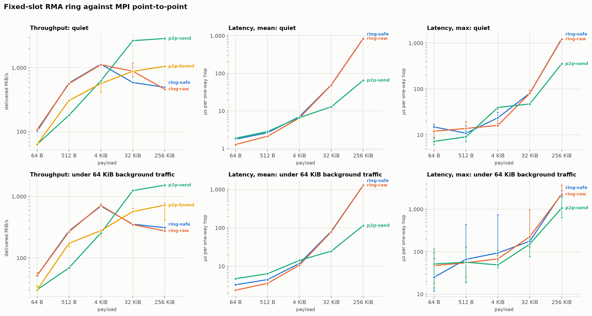

# mpi-rma

[](https://github.com/PKD667/mpi-rma/actions/workflows/ci.yml)
[](https://crates.io/crates/mpi-rma)
[](https://docs.rs/mpi-rma)
[](LICENSE)

Typed, safe MPI one-sided communication (RMA) for Rust, on top of
[rsmpi](https://docs.rs/mpi). It exposes the raw RMA calls rsmpi hides and
ships a fixed-slot ring transport for message-passing patterns that plain
point-to-point does badly.



Perform almost 4x faster than Point-to-Point MPI with small payloads and in a noisy environnement. 

*DISCLAIMER: this was only tested on single node configurations, and it might loose much of its advantages in multi-node setup. COuld be interesting to couple p2p sends for cross-node packets and RMA for same-node*

## Why a ring

A fixed-slot ring puts payloads into pre-allocated RMA slots. Polling reads
local memory. Raw senders never wait for the receiver; safe senders wait only
when they would overwrite an unacknowledged slot.

- **Safe mode** blocks the sender with a cumulative ack gate. Nothing is ever
  dropped, and the sender can't lap the receiver.
- **Raw mode** never blocks. Unread slots are overwritten and the receiver
  learns about the gap through `lost()`.

Polling is local memory access in both modes. Each safe `ack` call uses one
atomic MPI operation; raw receivers never enter MPI.
Measurements live in [BENCHMARKS.md](BENCHMARKS.md).

## Quick start

```rust
use mpi_rma::Ring;
use mpi::topology::Communicator;

let (universe, _) = mpi::initialize_with_threading(mpi::Threading::Multiple)
    .expect("MPI must provide Threading::Multiple");
let world = universe.world();

// One lane from rank 0 to rank 1: 
//     8 slots of 64 KiB each. 
// Every rank passes the same list.
let ring = Ring::safe(&world, &[(0, 1, 8, 64 * 1024)])?;

if world.rank() == 0 {
    ring.send(1, b"hello from rank 0")?;
} else if world.rank() == 1 {
    'receive: loop {
        for message in ring.poll()? {
            eprintln!("got {} from rank {}", message.data.len(), message.origin);
            ring.ack(message.origin, message.sequence)?;
            break 'receive;
        }
        std::thread::yield_now();
    }
}
ring.close()?;
```

`mpi-rma` gives these operations a Rust API and checks the lane layout
collectively before allocating windows.

## Features

- `allocate_window` with put, get and fetch-add on every rsmpi
  communicator, via `mpi_rma::traits::*`.
- A fixed-slot [`Ring`](https://docs.rs/mpi-rma/latest/mpi_rma/struct.Ring.html)
  transport: backpressure in safe mode, bounded overwrite in raw mode.
- Slots carry a sequence, length and CRC32, making corruption and loss
  observable rather than silent.
- Zero allocations on the send path beyond slot payloads; no per-message MPI
  bookkeeping.

## Try it

```sh
cargo build --release --examples

mpirun -n 2 "target/release/examples/test_ring"
mpirun -n 2 "target/release/examples/compare" 20000 32 0 11
```

An MPI implementation with a unified-memory window model is required
(OpenMPI 4+, MPICH 4). See [design.md](design.md) for the slot layout and
sequencing rules, and `scripts/bench.sh` to reproduce the measurements.

## License

MIT. See [LICENSE](LICENSE).
